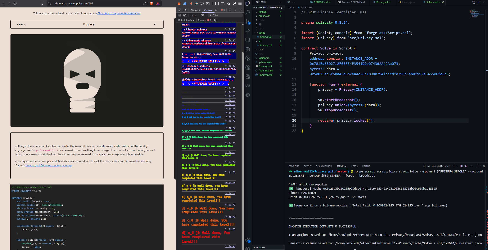

```
Submit level txnHash: 0x52af3ff4da5a6312e6ea37461191bfc892b3c42635e01cca954e5c4cdb2dc9fe
Instance address: 0x781Ed6302712F63EE4F3541DDe074302A42Aa073
Level address: 0x19416E8a80660FE4A6f88a12d28BEb729A349052
```

```bash
forge inspect Privacy storageLayout # using for output in terminal
forge build --extra-output storageLayout #using  for output in json
```
`data[3] data` start at `slot#3` therefor `data[2]` is in `slot#5`.
it is `bytes32` and we need `bytes16` so we do this:
```javascript
bytes32 data = 0x5e075ed5f50a45d0b2ea4c26b18980794fbccdfe398b3eb0f992a6465e6fd6d5;

privacy.unlock(bytes16(data));
```
